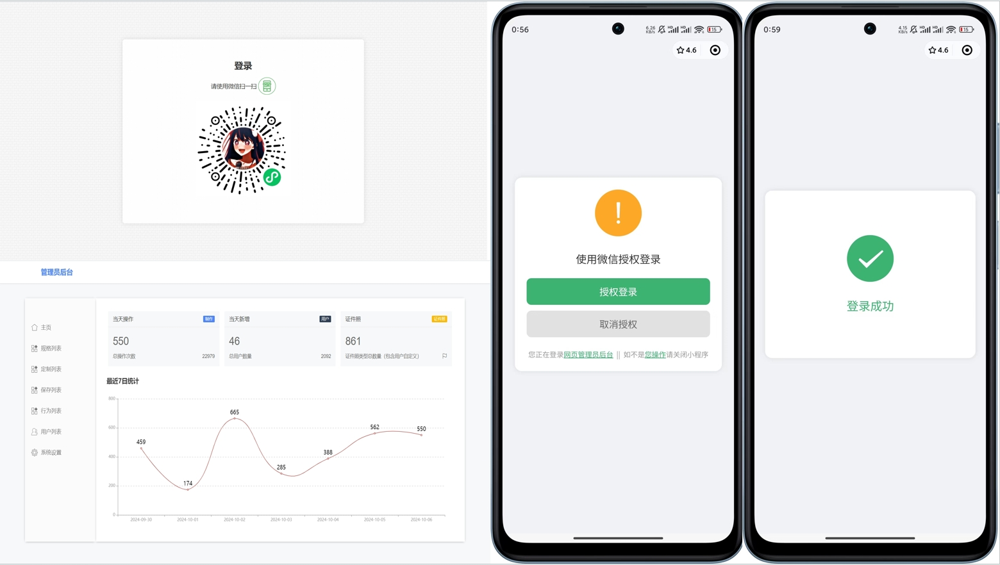
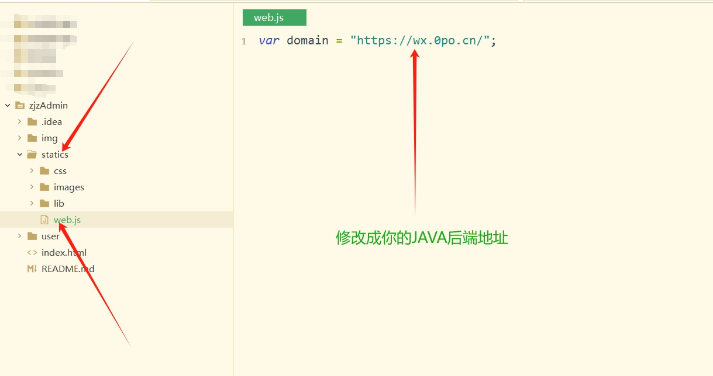
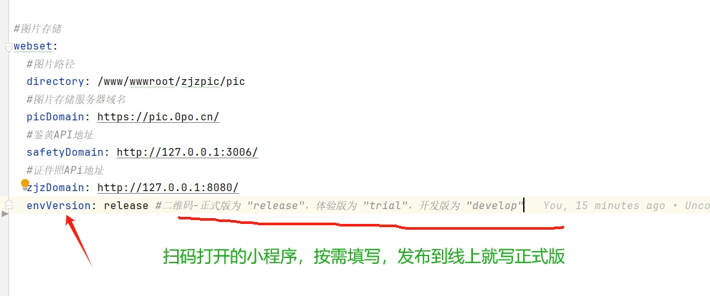

# 项目介绍

# 
小程序管理员后台

一码连接小程序，数据增长了如指掌

**相关项目**：

- 小程序前端请前往：https://github.com/no1xuan/photo
- 小程序后端请前往：https://github.com/no1xuan/HivisionIDPhotos-wechat-weapp

------

# ⭐最近更新
- 2024.10.22：修复首页单词拼写错误而导致的记忆登录没生效
- 2024.10.07：更新管理员后台，从此版本开始为长期稳定版本，基本不会频繁更新

 

# 🔧部署

打开statics/web.js，修改一个地址就好啦
 
然后上传到服务器部署静态网站就一切OK啦

 

# ⚡️注意事项
1. 建议小程序发布到线上后再部署管理员网页后台。
如果你想本地测试，就打开JAVA后端的application.yml，然后按需操作修改
2. 默认使用小程序第一个注册（id=1）的当作管理员，其它用户均无法登录管理员后台，请熟知

 

# 📚引用

管理员后台模板借鉴了【郑州市鹧应网络科技有限责任公司】旗下的鹧应证件照：https://zjzapi.com
 
如侵犯到贵公司，十分抱歉，请与我联系，我将删除源代码

 

## 📧其它

您可以通过以下方式联系我:

QQ: 24677102

微信：webxuan
